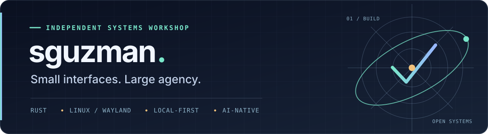

<!-- The profile is a front door, not a changelog. Project details live in their repositories. -->
<p align="center">
  
</p>

<p align="center">
  <strong>Rust-built software for curious people and computers that belong to their users.</strong><br/>
  <sub>Local-first · Linux / Wayland · Agent-friendly · Thoughtful interfaces</sub>
</p>

---

### Hello, I'm Salvador.

I build tools that make the computer feel more like an **instrument** and less like an obstacle. My work ranges from tiny, fast desktop utilities to ambitious systems for reading, preserving, organizing, and manipulating information.

I like **Rust**, native Linux applications, durable local state, inspectable behavior, and software that respects attention. I use AI extensively to develop software, and I design for human *and* agent collaborators: clear architecture, reproducible tests, explicit permissions, and machine-readable interfaces. MCP is useful when it serves those goals, not a requirement for every application.

I care about the engineering **and** the feeling of using the thing. Serious internals can still produce cozy, playful software.

### Selected work

| | |
| :--- | :--- |
| **[Chatarium](https://github.com/sguzman/chatarium)** | A local-first Rust conversation workstation: durable message state, recoverability, and a path toward user-controlled AI tooling. |
| **[Morphos](https://github.com/sguzman/morphos)** | Declarative 3D geometry with a shared Rust workspace model for desktop editing, automation, and reviewable AI changes. |
| **[Ephemeris](https://github.com/sguzman/ephemeris)** | A programmable calendar and temporal-information system where canonical events can appear in many different views. |
| **[LanternLeaf](https://github.com/sguzman/lantern-leaf)** | A reading environment for books and documents with local Piper speech, synchronized highlighting, and a little personality. |
| **[Glyphflick](https://github.com/sguzman/glyphflick)** | A blink-fast Wayland glyph picker. Summon, find, copy, disappear. |
| **[Starbyte](https://github.com/sguzman/starbyte)** | An experimental, comfort-first SNES emulator in Rust. Fun and desktop experience matter more than chasing perfect cycle accuracy. |

### Also on the workbench

**[OTPick](https://github.com/sguzman/otpick)** · Encrypted, low-latency Linux TOTP picker  
**[Lexwright](https://github.com/sguzman/lexwright)** · A local-first English writing instrument  
**[Vessel](https://github.com/sguzman/vessel)** · Rust control plane for media transcription and research text  
**[Mirrarium](https://github.com/sguzman/mirrarium)** · Durable browser capture and local caching experiments  
**[Caliberate](https://github.com/sguzman/caliberate)** · A Rust-native, still-in-progress ebook platform

### The through-line

```text
human intent
  → clear interfaces
  → explicit permissions
  → durable local state
  → inspectable and reversible actions
```

**My default:** build the core in Rust; reuse mature tools where appropriate; make the fast path *actually* fast; keep data portable; and document what works, what doesn't, and what is still experimental.

<p align="center">
  <sub>Make it useful. Make it understandable. Make it a pleasure to use.</sub>
</p>
